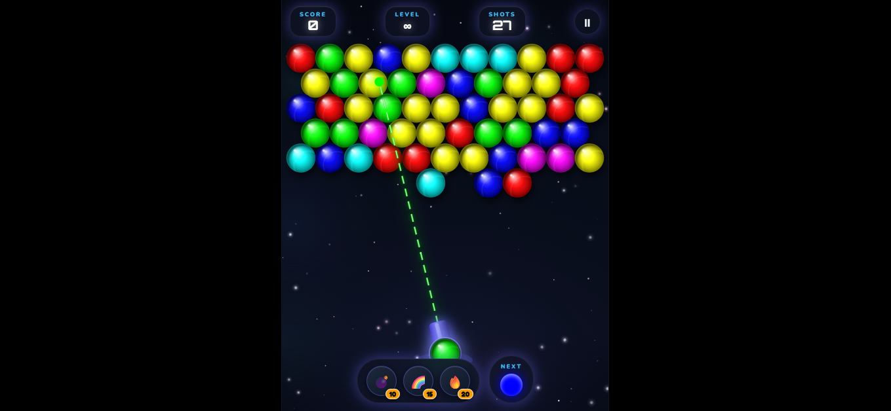
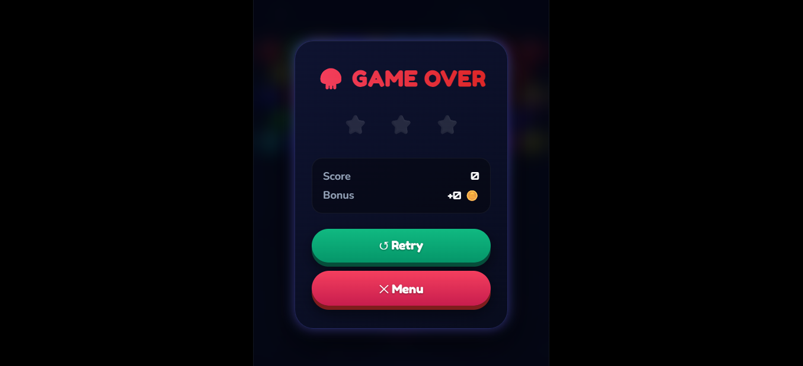
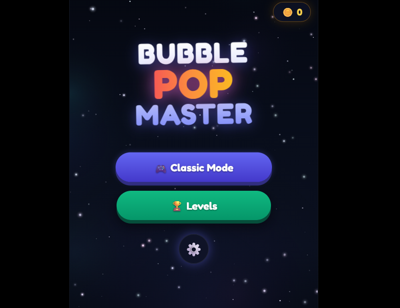

<p align="center">
  
</p>


# Bubble Pop Master - Professional Bubble Shooter Game

A polished, Play Store-quality bubble shooter game built with HTML5 Canvas and JavaScript.

# Live Demo
https://orbital-clash.vercel.app/


## Features

### Core Gameplay
- ✅ Hexagonal grid-based bubble system
- ✅ Bubble snapping to grid on collision
- ✅ Match-3 bubble detection and removal
- ✅ Chain reactions and falling bubble physics
- ✅ Progressive level system with target scores

### Shooting System
- ✅ Mouse-controlled rotating cannon
- ✅ Dotted trajectory line with wall bounce prediction
- ✅ Next bubble preview in HUD
- ✅ Special power-up bubbles (Bomb, Rainbow, Fire)

# Screenshots




### Visual Design
- ✅ Enhanced bubble graphics with gradients, gloss, and shadows
- ✅ Glowing effects for aiming and special bubbles
- ✅ Animated particle background
- ✅ Screen shake effects on impact
- ✅ Modern UI with glowing panels

### Effects & Audio
- ✅ Pop animations with particle explosions
- ✅ Floating score text (+100, +200, etc.)
- ✅ Screen shake on bubble impact
- ✅ Procedural background music
- ✅ Sound effects for all actions

### UI/HUD
- ✅ Stylish HUD with Orbitron font
- ✅ Score, level, and shots remaining display
- ✅ Glowing UI panels with backdrop blur
- ✅ Start screen, pause menu, game over screen
- ✅ Level selection with progress tracking

### Game States
- ✅ Main menu with play options
- ✅ Pause functionality (ESC key)
- ✅ Game over screen with restart
- ✅ Level progression system

## How to Play

1. **Aim**: Move your mouse to rotate the cannon
2. **Shoot**: Click to fire bubbles
3. **Match**: Create groups of 3+ same-colored bubbles
4. **Chain**: Cause chain reactions for bonus points
5. **Survive**: Don't let bubbles reach the bottom!

## Controls

- **Mouse**: Aim and shoot
- **ESC**: Pause game
- **Click**: Navigate menus

## Technical Features

- **Performance**: RequestAnimationFrame for smooth 60fps gameplay
- **Code Structure**: Modular ES6 classes (Bubble, Grid, Shooter, etc.)
- **Audio**: Web Audio API for procedural music and sound effects
- **Save System**: LocalStorage for progress and settings
- **Responsive**: Adapts to different screen sizes

## File Structure

```
bubble_shooter/
├── index.html          # Main HTML structure
├── css/
│   └── style.css       # Styling with modern effects
└── js/
    ├── main.js         # Game loop and state management
    ├── config.js       # Game constants and settings
    ├── bubble.js       # Bubble class with enhanced visuals
    ├── grid.js         # Hexagonal grid system
    ├── shooter.js      # Cannon and projectile logic
    ├── particles.js    # Effects and animations
    ├── background.js   # Animated background renderer
    ├── ui.js           # UI management
    ├── audio.js        # Sound effects and music
    ├── input.js        # Input handling
    ├── save.js         # Save/load system
    └── levels.js       # Level generation and data
```

## Running the Game

Simply open `index.html` in a modern web browser. The game works offline and saves progress locally.

## Browser Compatibility

- Chrome 70+
- Firefox 65+
- Safari 12+
- Edge 79+

Requires Web Audio API support for sound effects.